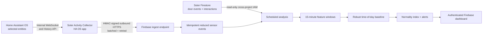

# Soter Household Activity Normality

An authenticated Firebase web app and Home Assistant OS app that combine movement/current sensors with privacy-minimised Soter doorstep events, learn a household-specific activity baseline, and highlight sustained departures from it.

The pilot household is `household-mpcck67b-epr7fs` in `doorassistant-bc50a`. The application and derived data run in `soter-updater-59ead` on the separate Firebase Hosting site `soter-normality`.

## Architecture



No service connects inbound to the home. The collector uses Home Assistant's Supervisor-provided API token internally and makes ordinary outbound HTTPS requests, so the router needs no open ports and Tailscale can remain an administrative path only.

The collector maintains a persistent SQLite queue, subscribes to live `state_changed` events, and runs overlapping History API recovery after startup, reconnects, and each hour. Firebase accepts only requests with a valid timestamped HMAC signature, rejects replayed nonces, enforces the configured entity allowlist, and writes deterministic event IDs so retries are safe.

## How scoring works

Each completed window contains aggregate movement counts, active sensor count, average/peak current or power, door openings, Soter interactions, recognised-resident events, and conservatively inferred arrival/departure events. No image, name, scene description, transcript, or unrelated Home Assistant attribute is copied.

The window is compared with nearby time slots from the prior 42 days, separated into weekday/weekend. Median and median absolute deviation (MAD) produce a robust distance, converted to a 0–100 normality index. Defaults require an index below 30 for two consecutive windows before an alert is created. The model stays in **learning** mode until 24 comparable windows exist.

This is decision support, not an emergency, medical, or life-safety system. A low index means “different”, not “harm”. Sensor outages, holidays, visitors, and changed routines can produce legitimate departures.

## Development

Requirements: Node.js 22 and Python 3.11 or newer.

```sh
npm install
npm test
npm run build
```

The repository root is a valid Home Assistant app repository (`repository.yaml`). The app itself is in `home_assistant_collector/`.

## Firebase deployment

Requirements: Firebase CLI, Google Cloud CLI, and access to both Firebase projects.

Create a random secret of at least 32 characters. Store the same value in Firebase Secret Manager and, later, the HA app's `ingest_secret` option. The helper reads without placing the value in shell history:

```sh
npm run secret:ingest
```

Optional alert webhook URLs use a separate secret:

```sh
npm run secret:webhook
```

One-time least-privilege runtime identity:

```sh
PROJECT=soter-updater-59ead
SOURCE=doorassistant-bc50a
SA=ha-sensors-runtime@$PROJECT.iam.gserviceaccount.com
gcloud iam service-accounts create ha-sensors-runtime --project "$PROJECT" --display-name "HA Sensors runtime"
gcloud projects add-iam-policy-binding "$SOURCE" --member "serviceAccount:$SA" --role roles/datastore.viewer
gcloud projects add-iam-policy-binding "$PROJECT" --member "serviceAccount:$SA" --role roles/datastore.user
gcloud projects add-iam-policy-binding "$PROJECT" --member "serviceAccount:$SA" --role roles/secretmanager.secretAccessor
```

Deploy the function and isolated Hosting site:

```sh
npx firebase-tools deploy --only functions:ha-sensors,hosting:normality --project soter-updater-59ead
```

## Configure and install

1. Sign in at [soter-normality.web.app](https://soter-normality.web.app), open Settings, and save the entity allowlist. Use one line per entity:

   ```text
   binary_sensor.hall_motion,motion,Hall
   binary_sensor.bedroom_motion,motion,Bedroom
   sensor.kettle_current,current,Kettle
   sensor.tv_power,power,Television
   ```

2. In Home Assistant OS, open **Settings → Apps → App store → Repositories**, add `https://github.com/frstep-im/HA_Sensors`, and install **Soter Activity Collector**.
3. Configure the same entity IDs and kinds in the app, paste the shared ingest secret, and start it.
4. Confirm the dashboard shows `haos-collector-001` as online with queue depth zero.
5. Enable analysis in the dashboard and rebuild 14 days after the first HA history upload completes.

The default initial HA recovery is 336 hours. It is limited by the Recorder retention configured in Home Assistant.

## Data and operations

Derived data lives under `normality_households/{householdId}` with `sensor_events`, `soter_events`, `windows`, `alerts`, and short-lived `ingest_nonces` subcollections. Reduced events and nonces carry an `expiresAt` field; configure Firestore TTL for the intended retention policy. Feature windows can be retained longer for seasonal analysis.

The browser never reads Firestore directly. Firebase Authentication is checked by the API against a verified-email allowlist, and existing updater Firestore rules are not modified. The runtime identity has read-only access to the source Soter project.

For rollout, operate in shadow mode for at least two weeks, label false positives, monitor collector freshness and queue depth, and agree who receives and acknowledges alerts before enabling the optional webhook. If the collector is stale, do not interpret the last score as current.
