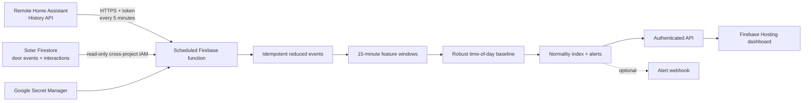

# Soter Household Activity Normality

An authenticated Firebase web app that combines Home Assistant movement/current sensors with privacy-minimised Soter doorstep events, learns a household-specific activity baseline, and highlights sustained departures from that baseline.

The pilot household is `household-mpcck67b-epr7fs` in `doorassistant-bc50a`. The application and derived data run in `soter-updater-59ead` on a separate Hosting site, `soter-normality`, so deploying it does not replace the existing updater dashboard.

## Architecture



Five-minute History API pulls are a better fit than a permanent WebSocket for this use case: analysis uses completed 15-minute windows, while overlapping cursors and deterministic IDs make retries safe. Home Assistant must be reachable over HTTPS, such as through Home Assistant Cloud or a properly secured reverse proxy.

## How scoring works

Each completed window contains only aggregate movement counts, active sensor count, average/peak current or power, door openings, Soter interactions, recognised-resident events, and conservatively inferred arrival/departure events. No image, name, scene description, or transcript is copied from Soter.

The window is compared with nearby time slots from the prior 42 days, separated into weekday/weekend. Median and median absolute deviation (MAD) produce a robust distance, converted to a 0–100 normality index. Defaults require an index below 30 for two consecutive windows before an alert is created. The model stays in **learning** mode until 24 comparable windows exist.

This is decision support, not an emergency, medical, or life-safety system. A low index means “different”, not “harm”. Sensor outages, holidays, visitors, or changed routines can all produce legitimate deviations.

## Setup

Requirements: Node.js 22, Firebase CLI, Google Cloud CLI, and access to both projects.

```sh
npm install
npm test
npm run build
```

Store the Home Assistant long-lived access token without putting it in shell history:

```sh
npm run secret:ha
```

One-time least-privilege runtime identity:

```sh
PROJECT=soter-updater-59ead
SOURCE=doorassistant-bc50a
SA=ha-sensors-runtime@$PROJECT.iam.gserviceaccount.com
gcloud iam service-accounts create ha-sensors-runtime --project "$PROJECT" --display-name "HA Sensors runtime"
gcloud projects add-iam-policy-binding "$SOURCE" --member "serviceAccount:$SA" --role roles/datastore.viewer
gcloud projects add-iam-policy-binding "$PROJECT" --member "serviceAccount:$SA" --role roles/datastore.user
gcloud projects add-iam-policy-binding "$PROJECT" --member "serviceAccount:$SA" --role roles/secretmanager.secretAccessor
```

Create/link the isolated Hosting site and deploy:

```sh
npx firebase-tools hosting:sites:create soter-normality --project soter-updater-59ead
npx firebase-tools target:apply hosting normality soter-normality --project soter-updater-59ead
npx firebase-tools deploy --only functions:ha-sensors,hosting:normality --project soter-updater-59ead
```

Sign in at `https://soter-normality.web.app`, open Settings, and configure entities one per line:

```text
binary_sensor.hall_motion,motion,Hall
binary_sensor.bedroom_motion,motion,Bedroom
sensor.kettle_current,current,Kettle
sensor.tv_power,power,Television
```

Save with scheduled collection off, run the 14-day backfill, inspect the baseline, then enable collection. Use `motion` for binary movement, `current` for amperes, and `power` for watts.

## Data and operations

Derived data lives under `normality_households/{householdId}` with `sensor_events`, `soter_events`, `windows`, and `alerts` subcollections. Raw reduced events carry a 90-day `expiresAt` field; enable a Firestore TTL policy on that field after confirming the study retention policy. Windows can be retained longer for seasonal analysis.

The browser never reads Firestore directly. Firebase Authentication is checked again by the API against a verified-email allowlist, and existing updater Firestore rules are not modified. The runtime identity has read-only access to the source Soter project.

For rollout, operate in shadow mode for at least two weeks, label false positives, monitor data freshness, and agree who receives/acknowledges alerts before enabling the optional webhook. If collection is stale or in error, do not interpret the last score as current.

## Repository

- `functions/`: ingestion, Soter feature reduction, robust scoring, authenticated API, schedule.
- `web/`: responsive React dashboard and configuration interface.
- `scripts/`: secret entry helper that avoids command-line/history exposure.
- `.github/workflows/ci.yml`: compile and test checks.

